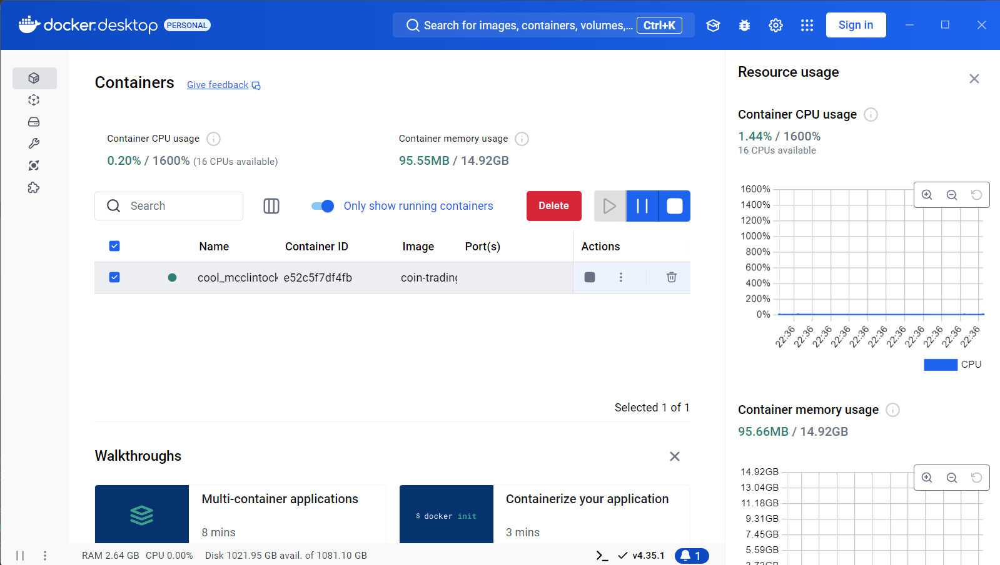
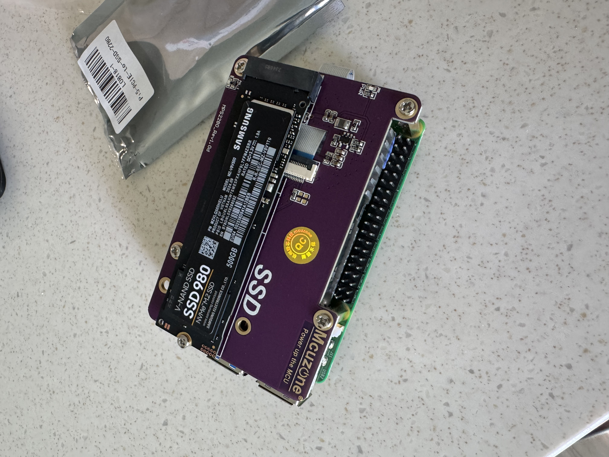
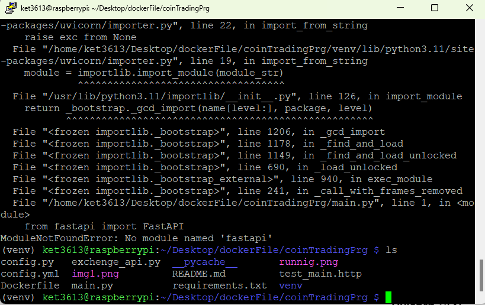

# Coin Trading Bot

## 소개
이 프로젝트는 볼린저 밴드를 기반으로 자동화된 코인 거래를 수행하는 Python 프로그램입니다. 특정 거래소의 API를 사용하여 매수/매도 전략을 실행하며, 주로 비트코인과 같은 암호화폐의 변동성에 대응하는 트레이딩 로직을 구현합니다.

## 주요 기능
- **볼린저 밴드 전략 사용**: 시장의 변동성을 분석하여 매수 및 매도 시점을 자동 결정합니다.
- **자동화된 거래**: 거래소 API를 통해 실시간으로 거래를 수행합니다.
- **설정 파일 관리**: `config.py`를 통해 거래와 관련된 주요 설정을 관리할 수 있습니다.

## 설치 방법
1. **프로젝트 클론**
   ```bash
   git clone https://github.com/ket3613/coinTradingPrg.git
   cd coinTradingPrg
   ```

2. **의존성 설치**
   ```bash
   pip install -r requirements.txt
   ```

3. **환경 설정**:
   `config.py` 파일을 편집하여 API 키, 거래소 정보 등을 설정합니다.



## 사용 방법
- 프로그램을 실행하여 자동으로 코인을 매수/매도하는 작업을 시작할 수 있습니다.
  ```bash
  python main.py
  ```

```bash
#실행 명령:
nohup uvicorn main:app --host 0.0.0.0 --port 8000 > app.log 2>&1 &

#실행 확인
ps aux | grep uvicorn

#프로세스 종료:
kill <프로세스_ID>
```




## 주의사항
- 이 프로젝트는 암호화폐 시장의 변동성에 의존하므로, 투자에는 항상 위험이 따릅니다.
- 테스트 환경에서 충분히 테스트 후 실거래에 사용해야 합니다.

## 기여
기여를 원하시는 분들은 Pull Request를 보내주시거나 Issue를 등록해 주세요.

## 라이선스
MIT 라이선스 하에 제공됩니다. 자세한 내용은 `LICENSE` 파일을 참고하세요.

---

이 README는 프로젝트의 주요 내용을 요약하고, 설치 방법 및 사용법을 쉽게 이해할 수 있도록 정리한 것입니다. 필요에 따라 내용을 추가하거나 수정해 주세요.
